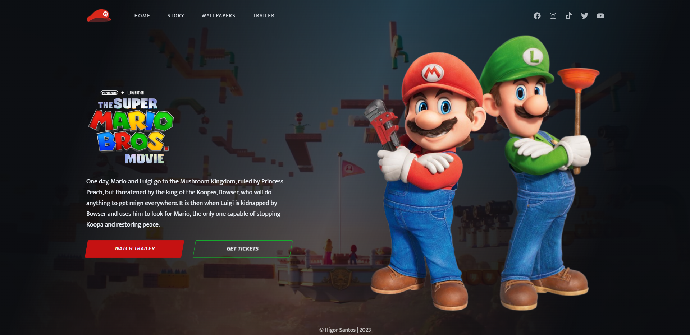

<h1 align="center">
  Landing Page - Super Mario Bros
</h1>

## 📷 Deploy

<h3>LINK: https://landing-mario.vercel.app/</h3>

## 💻 Projeto

Neste projeto realizado em aula, pratiquei o uso de HTML e CSS, para a criação de uma Landing Page do filme Super Mario Bros.

## 🚀 Tecnologias

- HTML
- CSS

## 📝 Aprendizados

- [x] Uso semântico do HTML
- [x] Uso do CSS Flexbox
- [x] Animações com a biblioteca [AOS]
- [x] Váriaveis do css no `:root`
- [x] Efeitos com a propriedade `transform` do css
- [x] Carregamento de vídeo no background
